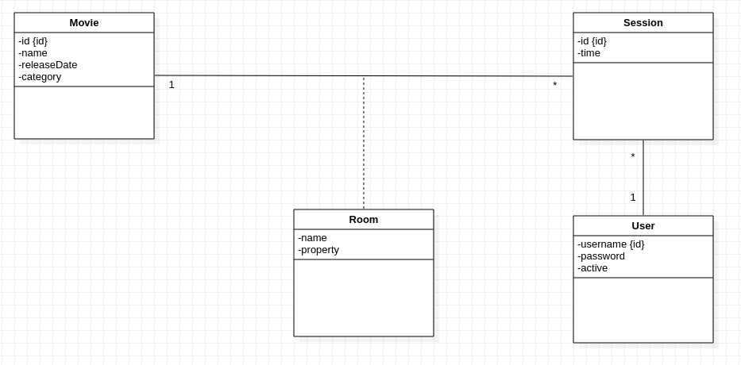

# AMT Project One - Functionnalities and implementation

**Authors: Nathanaël Mizutani, Olivier Koffi**

## Business model

This application allow users to log the movies they have seen. They can specify the cinema in which they have seen each one of them, along with the screening they attended and the room in which it took place. 

Diagram UML
 

## Functionnalities

This application is only accessible to registered member. So each visitor has to go through a login page.

On the home page the user can see a list of the screenings he entered in the application. He can click on them to get details.

Each user can see, only the screenings that he has created but movies and cinemas are public.

Each user can add/edit/delete screenings, movies or cinemas.

A pagging system is implemented with a fix value of 10 entries per page that can be change through the global variable `PAGE_SIZE` in the code.
movies