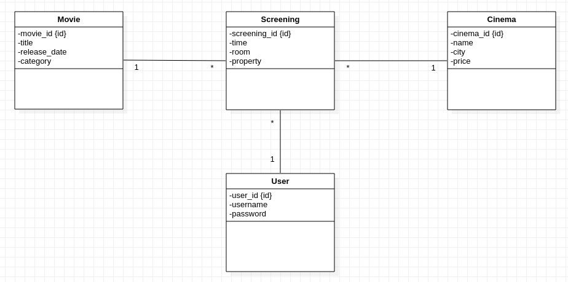

# AMT Project One - Functionnalities and implementation

**Authors: Nathanaël Mizutani [NatMiz](https://github.com/NatMiz), Olivier Koffi [Koffi94](https://github.com/Koffi94)**

## Business model

This application allow users to log the movies they have seen. They can specify the cinema in which they have seen each one of them, along with the screening they attended and the room in which it took place. 

## Functionnalities

This application is only accessible to registered member. So each visitor has to go through a login page.

On the home page the user can see a list of the screenings he entered in the application. He can click on them to get details.

Each user can see, only the screenings that he has created but movies and cinemas are public.

Each user can add/edit/delete screenings, movies or cinemas.

A pagging system is implemented with a fix value of 10 entries per page that can be change through the global variable `PAGE_SIZE` in the code.
movies

## Implementation

**UML diagram**
 

**Mockup**

Sources: Olivier Liechti AMT 2019 Courses

This project is organised in several tiers. It's a MVC based model but in our case we have tiers *Presentation, Model and Controller*.
### Model Tier
This tier contains domain object classes *Cinema, Movie, Screening and User*.
You can find them in **ch.heigvd.amt.projectone.model** path in the project.
These Java classes represent the database's tables.

### Presentation Tier
This tier contains servlet classes.
You can find them in **ch.heigvd.amt.projectone.presentation** path in the project.
Servlets are used to route requests and responses of the application.
They forward on JSP pages when needed and JSP format the content and send it back. 
Servlets filters are also use to manage authentications and authorizations.

### Service Tier
This tier contains DAO classes.
You can find them in **ch.heigvd.amt.projectone.services.dao** path in the project.
DAO classes are used to communicate with the MySQL database through the programming interface JDBC.