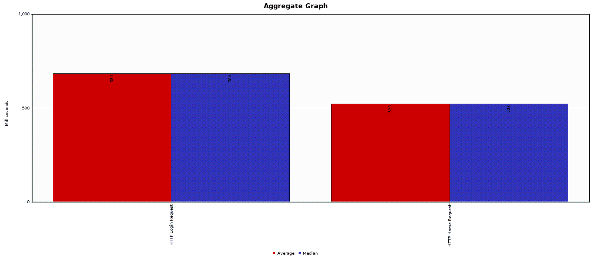
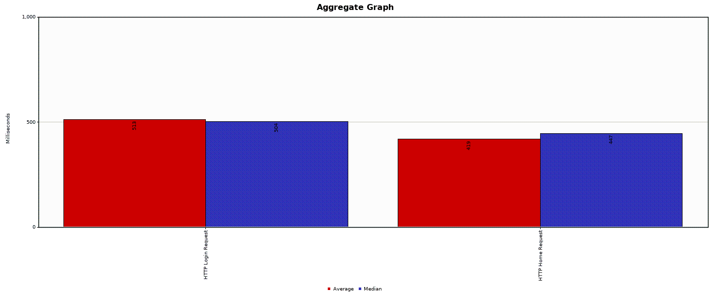
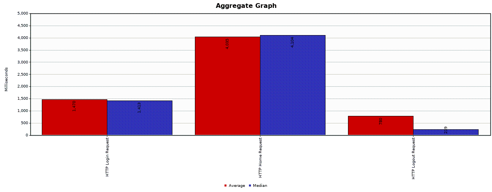
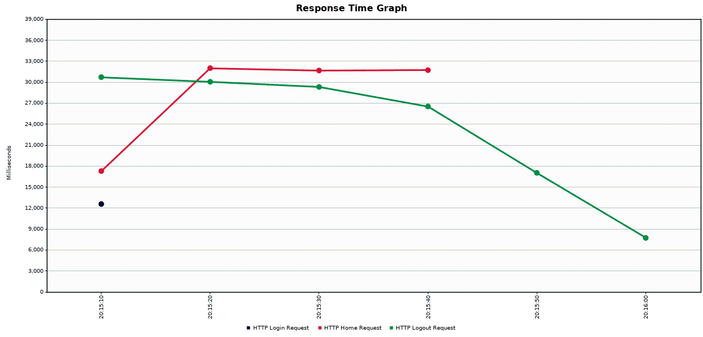
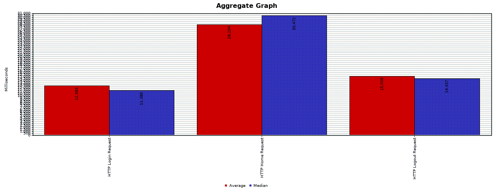
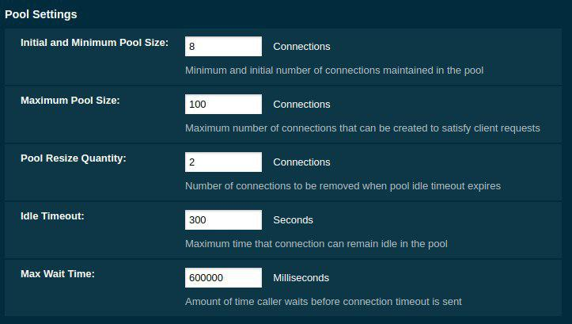

# AMT Project One - Tests
**Authors: Nathanaël Mizutani [NatMiz](https://github.com/NatMiz), Olivier Koffi [Koffi94](https://github.com/Koffi94)**

---

To run the tests, run the `runTests.sh` script.

## Unit Testing

### DAO Tests

We use Arquillian to test our DAO. Currently the tests are limited to check if the CRUD implementation of each DAO is working as expected.

The Arquillian tests allowed us to discover and fixed a security flaw in our code.
When testing the `updateUser()` method we realized that, contrary to `createUser()`, we didn't hashed the password before storing it. Therefore when updating a user password, the password was stored in plain text in the database. This is no more the case thanks to the test on `updateUser()`.

### Servlet Tests

The servlet were tested with Mockito. All the objects marked `@EJB` were made package protected to allow Mockito to work correctly.

Mockito mocks the DAO classes in order to test the domain objects, which are `Cinema`, `Movie`, `Screening` and `User`.

## Performance and Load Testing

The Payara container was tested with JMeter.

To simulate the absence of pagination, we displayed all screenings on a single page.

| Number of Users | Number of Entities per page | Total number of entities | CPU load | Memory Usage | Net I/O |
| --- | --- | --- | --- | --- | --- |
| 1 | 10'000 | 1'000'000 |203.91% | 1.391GB/15.56GB | 34MB/39.5MB |
| 100 | 1'000 | 1'000'000 |2.76% | 638.5MB/15.56GB | 2.89MB/3.13MB |
| 100 | 100 | 1'000'000 |169.22% | 2.381GB/15.56GB | 65.5KB/1.24MB |
| 1000 | 100 | 1'000'000 |509.60% | 721.3MB/15.56GB | 3.53MB/7.83MB |
| 1 | 1'000'000 | 1'000'000 |crash | crash | crash |

The pagination allows the server to serve many users without crashing under the load of the screening to display. To a certain extent.

### Graph

*1 user with 1000 entities*

*10 user with 100 entities each*

On both of the above graphics we can observe the long response time of the login and home requests. This is partly due to the way we access the database. We can also see the impact of Bcrypt on the response time; the login request takes always longer than the home request.

---

*100 users users with 100 entities each*

In the graphic above we can observe that when 100 users make 100 hundred simultaneously request, the response time explode. The difference between the login and the home response time is still there, a bit worse.

---

*1000 users with 100 entities each*

We can see that since all the users login at the same time, there is a single response time value of 12 seconds, which impact negatively the user experience. 

Something also interesting concerns the response time of the home and the logout request. We can see the home request response grow as the users access their home pages to see their entries. We can also notice that as the user logout one after another, the response time for logout decrease proportionally.

---

*1000 users with 100 entities each*

On the graphic above we can see that the observation made for 100 user with 100 entities each still hold for 1000 users with 100 entities each. Although the problems are worsening the more users there are.

### Connection Pool issue

During the load testing we came across the following issue: when more than 10 users were trying to login, simultaneously, the application crashed. It was caused by the limited size of the server's connection pool and the short wait time.

After some investigations, we discovered that our connection time for one user was around 300ms to 400ms. Which is too long. We identified the following factors to explain this long response time:
- Bcrypt takes approximately 100ms to hash a password; an operation we do for every password before storing it in the database.
- When we access the database, we use three queries; which delays further the response time. That could optimized with an inner join.

To mitigate this issue we increased the size of the connection pool to 100, and the value of the maximum wait time to 600'000. You can see below an image of the pool settings with the updated values:

